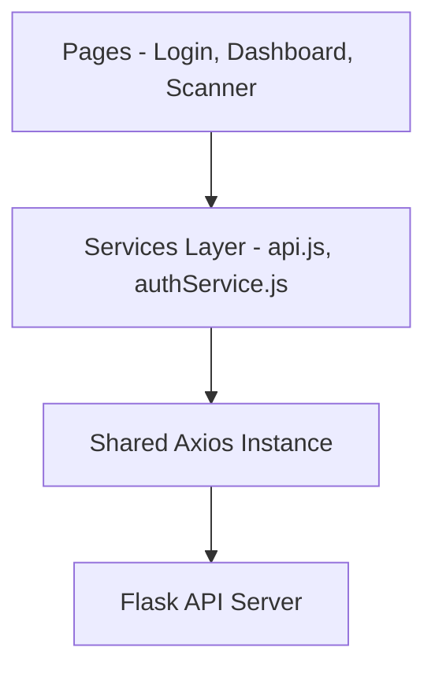
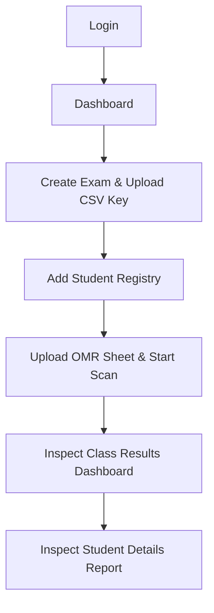

# ExamVision AI: Final Project Summary

This document presents a final architectural overview of the ExamVision AI application for version 1 release readiness.

---

## 1. Completed Modules & Implementation Status

| Page Module | Implemented Elements | API Connection Status |
| :--- | :--- | :--- |
| **Login Gateway** | Persistence verification side effect, `rememberMe` checkbox configurations bound to storage, credentials default prepopulated correctly. | Fully integrated (`POST /auth/login`) |
| **Dashboard** | Dynamic live exam summaries list loading, stats trackers clean label setups, recent activity timelines empty state. | Integrated (`GET /exams`) |
| **Create Exam** | Multipart CSV answer key parsing and uploads, dynamic cohort student addition cards. | Fully integrated (`POST /exams`, `POST /exams/<id>/answer-key`, `POST /students`) |
| **OMR Scanner** | Image selector dialogs, async multipart start scan handler, live event terminal logs. | Fully integrated (`POST /scanner/start`) |
| **Results View** | Class statistics aggregator, top/bottom ranks list, paginated database queries filters. | Fully integrated (`GET /results/exam/<id>`) |
| **Student Details Report** | Benchmarks analytics radar charts, error categories analysis grids. | Fully integrated (`GET /results/student/<id>`) |

---

## 2. Project Architecture

The application is structured following clean abstraction layers separating UI representations, routing logic, and data fetch layers.

### Components Layer
- `api.js`: Sole Axios client initialized with headers setup and token handlers.
- `/services`: Houses REST API callers (`authService`, `examService`, `scannerService`, `studentService`).
- `/components/ui`: Visual system building-blocks (Card, Button, Badge, Table, Input).

---

## 3. Frontend Workflow

1.  **Authentication**: Users login. If `Remember Me` is configured, session identifiers are persistently retained.
2.  **Exam Provisioning**: Create exam records, upload answer key CSV, register students.
3.  **OMR Scanner**: Operator selects sheets and triggers processes. Terminal console logs update asynchronously.
4.  **Results Inspection**: Operator audits class rankings, scoring averages, and selects student scorecards to check individual topics performance.

---

## 4. Version 1 Boundaries & Scope

### In-Scope Functionality
*   Secure token session managers.
*   Examinations creator modules with CSV validations.
*   Student registry manager widgets.
*   Asynchronous multi-part scanning form processors.
*   Live class scorecard tables and error radar charts.

### Disabled/Guarded Features (Out of Scope)
*   **Forgot Password Link**: Blocked, alerts `"This feature is not available in the current release."`
*   **User Avatar Profile/Settings**: Disabled in navigation menus.
*   **Reports PDF/CSV Exports & Notifications**: Click triggers alert `"This feature is not available in the current release."`
*   **Historical Trends Comparison**: Card stats metrics display `"No historical comparison available"` rather than using misleading trends arrows.

---

## 5. Potential Enhancements (Version 2)
1.  **Notification Hubs**: Incorporate Live WebSockets event streams to push scanning operations alerts.
2.  **Profile configuration panel**: Enable avatars image uploads and profile change settings.
3.  **PDF/CSV Compiler**: Move report template renderings directly into client-side file compressors.
4.  **Multi-Factor Auth (MFA)**: Support password resets and verification OTP handlers.
5.  **Multi-Tenant Portal**: Enable teachers, instructors, and student accounts registry matching permission restrictions.
